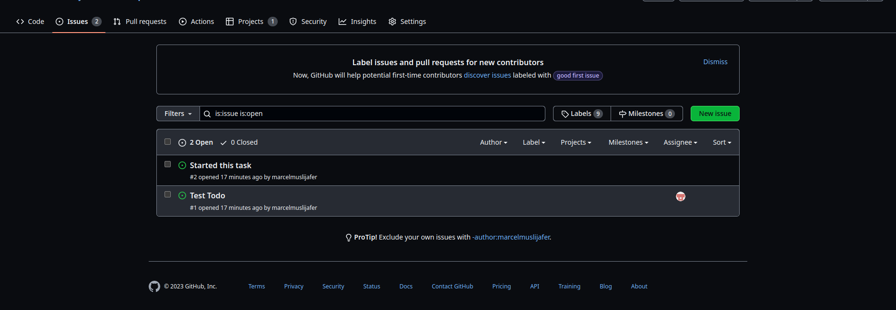
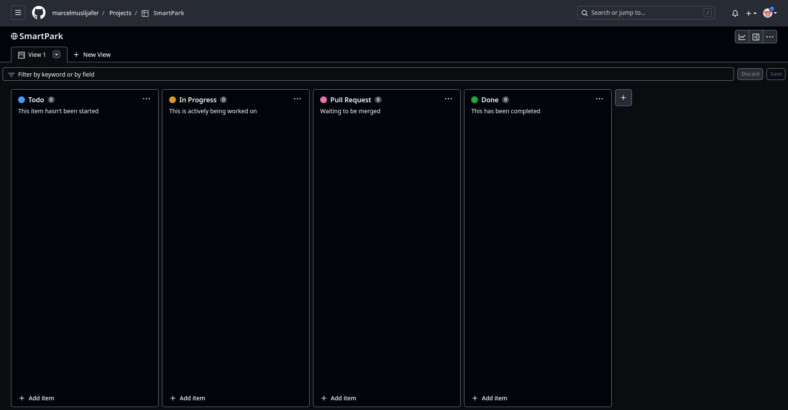

# Welcome to the SmartPark project

Thank you for investing your time in contributing to this project!

In this guide you will get an overview of the contribution workflow from opening an issue, creating a pull request, reviewing, and mergin the PR.

---

## Issues

GitHub issues allows users to track and manage software development tasks, bugs and other issues related to a software project.

### Create a new issue

Issues can be created under the issue tab by clicking on the **new issue** button.

Every issue should have a title.

For issue titles please use the following format:

**\<module\>: \<description\>**

For example, an issue for setting up a local environment to work with devices would have a title like:
- devices: setup local environment

To assign an issue to yourself or a team member, select the issue and choose one or multiple assignees on the right hand side of the issue view.
Issues can be created without an assignee.

To finish creating an issue press the **Submit new issue** button.

Issues can also be created in the project board.

---

## Project board

The project board is used to manage issue progress. You can access the project board by selecting the **SmartPark** project under the **Projects** tab.

There are four progress sections:

1. **Todo** 	    - work hasn't been started yet, 
2. **In Progress**  - actively being worked on,
3. **Pull Request** - waiting to be merged to master branch,
4. **Done**		    - successfuly compeleted.

Issues can be created directly on the project board: 
1. Click on the **+ Add item** button.
2. Type **#** and select the smart-park repository.
3. Enter the issue title.
4. Fill in issue details in the dialog box.

Please keep the project board up-to-date.

---

## Making changes & resolving issues

When resolving issues you will probably want to make changes to the repository.

Changes to the master branch can only be made through pull requests. A pull request is a request to merge branches.

Here are the steps for creating a pull request:
1. Create a separate branch in your local repository **(git checkout -b \<branch-name\>)**. The branch name should be equal to the issue title you're resolving with each word separated using '**-**'. **For example: 'devices-setup-local-environment'**.
2. Before commiting any changes, make sure you are on the right branch.
3. Commit changes.
4. Push the branch to the remote repository (git push origin \<branch-name\>).
5. Open a pull request on github to merge the pushed branch with master.
6. Add a reviewer for your pull request. The reviewer should be a person that is also working on the module of the issue or the team lead.
7. Wait for approval from the reviewer  for your pull request.
8. Merge the branch.
9. Delete the branch on the remote repository.
10. In your local repository: switch to the master branch, pull changes from the remote master branch and delete the separate branch.

**Steps 6 and 7 are highly recommended, but optional.**

